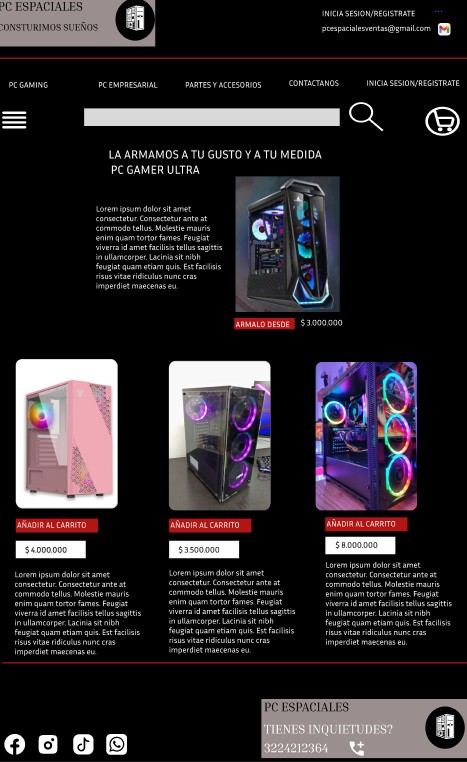

# Bit-1

Sitio web enfocado a las ventas de las computadoras que contiene las siguientes tecnologias.

\* Lenguajes & Tecnologias

- HTML
- CSS
- JavaScripts
- Bootstrap

## DESARROLLADOR

Este proyecto fue desarrollado por David Carrasco

### Diseño u Maqueta

Se procedio a desarrollar mi maqueta en Figma con una paleta de colores y sus diferentes deiseños teniendo en cuenta los parametros de UI/UX

#### Elaboracion del proyecto

1.REPOSITORIO

Se creo un repositorio mediante Github en el cual por medio de una carpeta en el escritorio y gracias a Git iniciando el proyecto los pudimos conectar de forma global para poder llevar el versionamientos y darles sus debidas mejoras y cambios.

2. HTML

Por medio de mi estructura HTML en los metadatos hicimos sus respectivas coneciones con lo que se debe entrelzar ya sea iconos, styles u scrips entre otras cosas nuestro proyecto cuenta con una carpeta de HTML en la cual poseo 5 archivos .html con los cuales tengo las diferentes secciones de mi pagina en la cual poseen cada una su seccion de computadoras empresariales y sus diferentes registros y contactos con los cuales se facilitaran la vida se manejo su correcta semantica de codigo para estructurar muy bien mi sitio web en sus diferentes secciones para que este tenga sus respectivas bases de acuerdo a las necesidades.

-index.html
-componentes.html
-contactanos.html
-login.html
-pc-empresarial.html

3. CSS

Se le generaron los diferentes estilos algunos fueron hechos manuales y otros fueron hechos con boostrap y replazando clases y cuentan con las siguientes modelos de distribucion

- Grid
- Flexbox

Tambien cuente con un responsive con las siguientes medidas.

- 575px
- 768px
- 992px

Y estilos con una paleta de colores acorde a la tematica de la clase.

4. JavaScript

Este fue el punto mas flojito y con menos detalle, aclaro que el carrusel hecho en el proyecto se implemento viendo un tutorial, y el captural los datos y la informacion si es por lo visto en la clase.

- Carrusel
- Formulario
